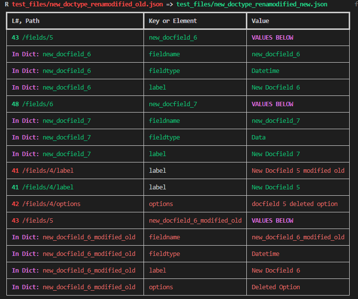
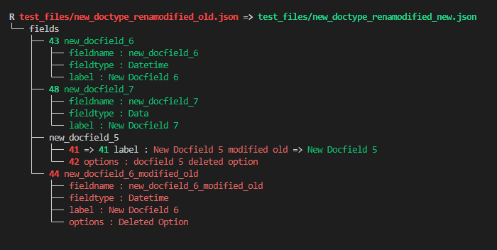

# Frappe Schema JSON Diff 

## Usage
When building and customizing Frappe Doctypes (schema), tracking changes can be challenging. Relying on the current state of the UI doesn't show past changes, and git's diff does not reflect the functional change, only the line-by-line diff of the json file. This script can be used as a standalone CLI tool or as part of a github action or CI workflow to produce a meaningful diff of schema changes. It uses Git's internal file manipulation via GIT_EXTERNAL_DIFF and displays output relevant to frappe applications.

### CLI Usage
Add the following to ~/.bashrc to use the mechanics of `git diff` while outputting the result of fsjd.

```
fdiff() {
    (
        export TABLE_MODE=1
        export GIT_EXTERNAL_DIFF=~/fsjd/frappe_schema_json_diff.py
        git --no-pager diff "$@"
        unset GIT_EXTERNAL_DIFF
    )
}
```

For example, `fdiff HEAD HEAD~1` is equivalent to running `git --no-pager diff HEAD HEAD~1` with the GIT_EXTERNAL_DIFF environment variable set, and `git diff` will work normally afterward.

### CI Implementation
The diff output will appear in a runner terminal for pull requests and pushes, and in the case of pull requests, a comment on the PR will also appear.


Copy the file `.github/workflows/main.yaml` along with its parent directories into the root folder of a custom app. Change the branch on lines 4 and 6 if applicable. Keep the `1` on line 24 to print table diffs or change it to `0` for trees.

## Output
Runner terminals will show JSON file names and diff content for any modified files, and names of deleted files. If any schema changes (changed JSON) are present, the workflow will fail.  
### CI Terminal
[example](https://github.com/robproject/fsjd/runs/8027932932?check_suite_focus=true#step:8:5)  
### Table

### Tree

## Design
### Dependencies
| Name                | Purpose                               | Links                                                                                                            |
| ------------------- | ------------------------------------- | ---------------------------------------------------------------------------------------------------------------- |
| **json-source-map** | Fetching line numbers for diffed data | [PyPI](https://pypi.org/project/json-source-map/) [GitHub](https://github.com/open-alchemy/json-source-map/wiki) |
| **Rich**            | Python output formatting              | [PyPI](https://pypi.org/project/rich/)             [GitHub](https://github.com/Textualize/rich)                  |

### Local Testing
1. Change or delete any json files located in `/test_files`
2. `bash ./run.sh`

### Function
A specific situation this tool is designed to account for is the deletion or reordering of elements in a list of dictionaries. If docfields (dictionaries) are added, deleted, or have their order changed, tools like DeepDiff will compare elements of the same index. FSJD will compare members of dictionary lists with matching common-key values. For example, docfields share the common-key 'field_name', so if two lists to be diffed contain dictionaries with this common-key, and their values match, those two dictionaries will be compared regardless of index. The tradeoff to this approach is that renaming a docfield (changing only the value of a common-key) will show a deleted and added docfield instead of a renamed value.
